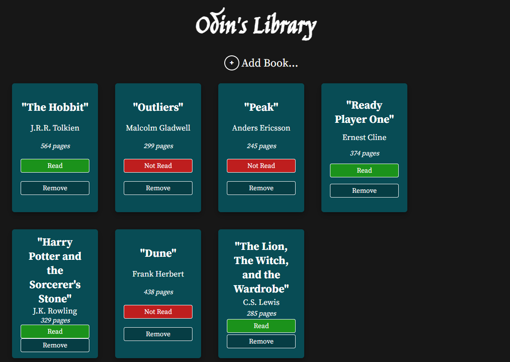
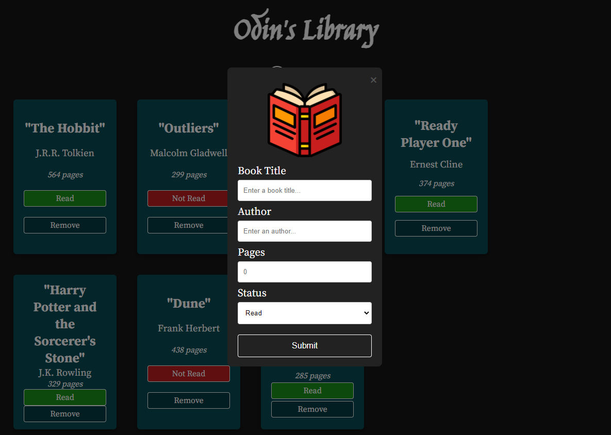

# 📚 Odin's Library

Odin's Library is a simple program that allows you to log the title, author, # of pages, and read status of a book that you own. That book becomes an object that is displayed in a card that can then be used to update the read status of the book, or remove the book from your collection.
The program also uses localStorage so that you are able to keep your books each time you visit the webpage. 

## 🔎 Overview

This project is a simple book-tracking application that allows a user to log the title, author, number of pages and status of a book that is in their library. This project served as an early test to use localStorage in an application.

## 🧩 Languages/Tools Used

* HTML
* CSS
* JavaScript
  * classes/constructors
* localStorage API

## 📷 Preview

## 🧠 What I Learned

This application taught me a lot about using localStorage and implementing it a project. I had a lot of struggles early on grasping when to use `JSON.stringify()` and `JSON.parse()`, and setting and retrieving those items. I feel much more confident after completing this project, and have since used localStorage to enhance my projects several times since.

This project also gave me a lot of practice using classes and constructors.

